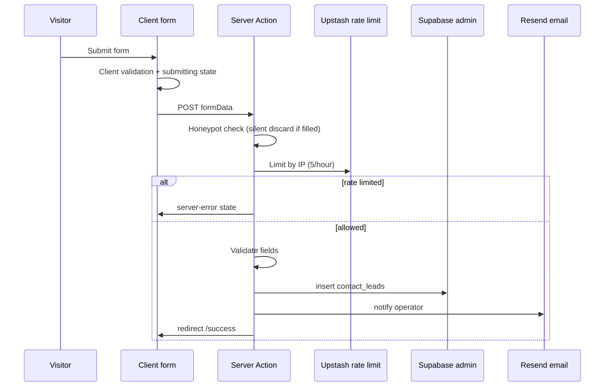
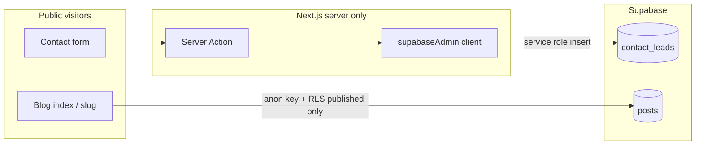
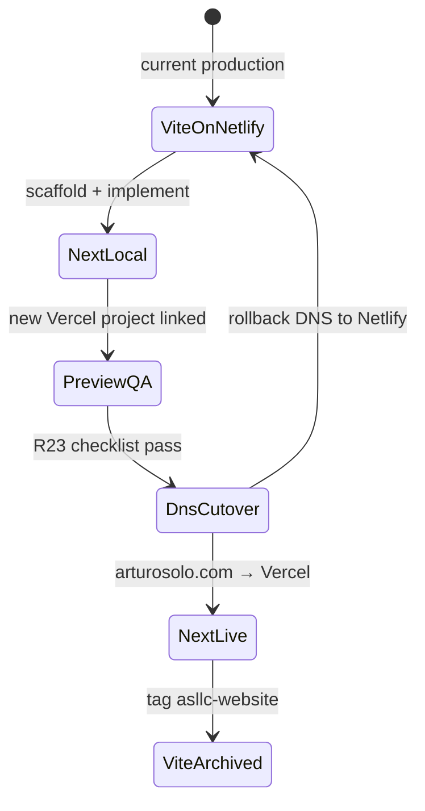

# feat: Fresh Next.js Repo for arturosolo.com

## Summary

Formalize this workspace as a **Next-only** repository (`arturo-solo-web`), complete the Arturo Solo positioning and security work left from the Nuggets scaffold, wire **preview/production Supabase isolation** on a **new Vercel project**, gate release with **CI (lint, build, unit, e2e)**, then **cut over `arturosolo.com`** from the live Netlify Vite site and archive `asllc-website` for active development. (see origin: `docs/brainstorms/2026-07-06-fresh-next-repo-requirements.md`)

---

## Problem Frame

The parallel-branch migration inside `asllc-website` proved that a mixed Vite + Next tree cannot reliably deploy on Vercel — Preview builds resolve to `source: static`, breaking `/contact` and `/blog`. The July 2026 greenfield decision is restored: a dedicated Next-only repo with no legacy publish artifacts. This workspace already has a clean Nuggets App Router skeleton; the remaining work is Arturo copy, server-mediated Supabase, tests, ops wiring, and cutover — not template import.

---

## Requirements

Requirements trace to origin R1–R26. Grouped by concern.

**Repository and delivery**

- R1. Repository contains only the Next.js 14 App Router site — no Vite tree, root `index.html`, or Netlify publish config.
- R2. Scaffold lineage is the purchased Nuggets template (already present; do not re-import from the abandoned feature branch as a file copy).
- R3. Production hosting is a **new Vercel project** linked to this repo. Supabase env vars scoped per deploy context. Service role key never ships to client bundles.
- R4. Preview and production use **isolated Supabase projects** (or strictly separated credentials).
- R5. `asllc-website` archived for active development after cutover; Netlify Vite on `main` stays live until DNS flip.
- R6. CI runs lint, build, unit tests, and e2e smoke before cutover.

**Positioning and content**

- R7. Homepage sections carry June 2026 positioning: working AI, built into your business — founder-led AI build studio.
- R8. Hero delivers the opening promise with contrast language (working systems, not decks or demos).
- R9. Services presents **AI Jumpstart** and **Custom AI Build** only.
- R10. Process describes: discover bottleneck → build until it runs → expand.
- R11. Stats presents hybrid proof without implying unfinished products are finished portfolio items.
- R12. Team is a visible solo-founder **"Why Arturo"** block.
- R13. Blog is Supabase-backed at `/blog`; zero posts at launch is acceptable.
- R14. Contact captures leads via **server-mediated** Supabase write with fields `name`, `email`, `company`, `service` (`ai-jumpstart`, `custom-ai-build`, `not-sure`), `message`, honeypot, and rate limiting.
- R15. Privacy Policy and Terms ship with Arturo-specific copy before public cutover.

**Experience and quality**

- R16. Framer Motion with `prefers-reduced-motion: reduce` fallbacks. No GSAP story-scroll port.
- R17. Fully responsive; SEO metadata on all public routes.
- R18. Contact path stays warm and lower-friction than kinetic homepage sections.
- R19. Contact form exposes submitting, validation-error, server-error, and success states.
- R20. Success confirmation via `/success` or equivalent inline state.
- R21. Mobile menu exposes `aria-expanded` and `aria-controls` with keyboard behavior verified.

**Security and cutover**

- R22. Supabase RLS on contact leads denies anonymous `SELECT`, `UPDATE`, `DELETE`.
- R23. Preview deploy verified before DNS cutover per smoke checklist.
- R24. DNS for `arturosolo.com` points to new Vercel production without breaking email or unrelated records.
- R25. After cutover, Vite codebase in `asllc-website` tagged or archived so history is recoverable.
- R26. `AGENTS.md` documents Next.js, Framer Motion, Supabase, and multi-section IA invariants.

---

## Key Technical Decisions

- KTD1. **This workspace is the new repo:** Initialize git, publish as `arturo-solo-web`. Do not repair `asllc-website` or rewire the stale `arturo-solo-website` Vercel project. (see origin: Key Decisions)

- KTD2. **Reference-only carry-over:** Copy, Supabase schema intent, env-var lists, and runbook steps come from the abandoned `feat/nextjs-nuggets` branch and sibling docs — re-implement in this tree, do not bulk-copy files. (see origin: Selective re-application)

- KTD3. **Separate Supabase projects for preview and production:** Two projects with Vercel env scoping (Production vs Preview). Cleanest isolation for R4.

- KTD4. **Server Action + server-only admin client for contact writes:** `'use server'` action with `import 'server-only'` Supabase admin client (`SUPABASE_SERVICE_ROLE_KEY`). Remove client-side anon inserts from `app/contact/page.tsx`. RLS enabled with no anon policies on contact table as failsafe.

- KTD5. **Rate limiting via Upstash Redis:** `@upstash/ratelimit` in the Server Action (5 submissions/IP/hour default). In-memory counters are insufficient on serverless.

- KTD6. **Operator notification via Resend:** After successful Supabase insert, send operator email from the Server Action. Operator should not rely on dashboard polling alone.

- KTD7. **Blog v1: infrastructure + dashboard publishing:** Public reads via server client + RLS (`status = 'published'`). Operator publishes via Supabase dashboard; no `/admin` route in v1. Homepage blog teaser hidden when post count is zero.

- KTD8. **Template-native section remap:** Keep Nuggets agency IA; rewrite sections for Arturo positioning. Repurpose or remove `app/customers/page.tsx` — it is not in the target IA.

- KTD9. **Old Vercel project left dormant:** Do not delete `arturo-solo-website` until cutover is stable; avoids losing mixed-tree deploy history during rollback window.

- KTD10. **Legal copy: template-edited for launch:** Adapt existing `app/privacy-policy/page.tsx` and `app/terms-of-service/page.tsx` with Arturo-specific fields and Supabase disclosure. Custom legal review deferred.

- KTD11. **Adapt cutover runbook into this repo:** Port operational steps from sibling `asllc-website/docs/runbooks/2026-07-05-vercel-cutover.md` into `docs/runbooks/` here, updated for fresh-repo paths and archive steps.

---

## High-Level Technical Design

### Section copy map (story beats → Nuggets IA)

| Nuggets section | Primary copy source | Notes |
|-----------------|---------------------|-------|
| Hero | Opening promise + bottleneck subhead | R7, R8 |
| Services | AI Jumpstart + Custom AI Build | R9 |
| Process | Discover → build until it runs → expand | R10 |
| Stats | Hybrid proof model | R11; client logos subordinate |
| Team (new) | "Why Arturo" solo-founder block | R12 |
| Blog teaser | Optional | Hidden when zero posts |
| Contact | Warm, lower-friction tone | R14, R18 |
| Header/footer | Builder CTAs | "Bring me a bottleneck" / "Start AI Jumpstart" |

Reference positioning baseline: sibling `asllc-website/docs/brainstorms/2026-06-01-ai-consultancy-pivot-requirements.md`.

### Contact submission pipeline

### Supabase security model

RLS on `contact_leads`: enabled, explicit deny for anon/authenticated on SELECT/UPDATE/DELETE; INSERT via service role only. Blog `posts`: public SELECT where `status = 'published'`.

### Cutover state machine

Rollback trigger: production contact e2e fails within 15 minutes of DNS flip. Revert DNS to Netlify; Vite on `asllc-website` `main` remains deployable until R25 archive.

---

## Scope Boundaries

### In scope

Git init and repo hygiene, Supabase schema/RLS, Arturo section remap, server-mediated contact with honeypot/rate limit/Resend, blog infrastructure (empty launch OK), legal pages, mobile nav ARIA, reduced-motion fallbacks, CI/e2e, new Vercel project, cutover runbook, `AGENTS.md`, legacy repo archive steps.

### Deferred for later

Per origin: historical Netlify Form migration, product screenshots, founder photography beyond available assets, dedicated case-study page, seed blog posts, custom `/admin` blog CMS, custom legal review beyond template-edited boilerplate.

### Outside this product's identity

Per origin: fixing Vercel on mixed `asllc-website`, GSAP story-scroll recreation, Netlify Forms as lead backend, parallel-branch workflow inside `asllc-website`.

### Deferred to Follow-Up Work

- Delete dormant old Vercel project after stable production week
- Real footer social URLs (remove or stub honestly at cutover)
- Netlify submission export tooling
- Portfolio/case-study page decision

---

## System-Wide Impact

- **End users (A1):** Site language shifts from Nuggets agency to founder-led AI builder; contact UX becomes the primary conversion path.
- **Operator (A4):** Lead flow moves to Supabase + Resend; blog publishing via Supabase dashboard.
- **Operations:** DNS, Vercel, and Supabase become the live stack; Netlify serves only as rollback target until archive.
- **Developers:** `asllc-website` retired for feature work; this repo becomes canonical.

---

## Risks & Dependencies

| Risk | Mitigation |
|------|------------|
| Vercel static misdetection | Next-only repo (R1 satisfied); verify AE1 on Preview before cutover |
| Service role key in client bundle | `server-only` admin module; CI grep / build audit |
| Test leads in production Supabase | KTD3 dual projects + Vercel env scoping |
| DNS breaks email | Preserve MX records; change A/CNAME web records only (KTD11 runbook) |
| Contact spam | Honeypot + Upstash rate limit (KTD5) |
| Cutover downtime | Low-traffic window; Netlify rollback documented |
| Nuggets template drift | Single Tailwind config; remove duplicate `tailwind.config.js` |

**Dependencies:** Nuggets template availability, GitHub org access, Vercel account, two Supabase projects, Upstash and Resend accounts, domain DNS access (may remain at Netlify registrar).

---

## Acceptance Examples

- AE1. **Covers R1, R3.** Given the repo is pushed, when Vercel builds Preview, build logs show the Next.js route table and runtime logs show `source` other than bare `static` for `/contact`.
- AE2. **Covers R7, R8.** Given a cold visitor lands on `/`, when they read the hero, they encounter builder language — not a design-agency tagline.
- AE3. **Covers R14, R19, R20.** Given a visitor submits valid contact data on Preview, when submission completes, a row appears in Supabase and the visitor sees warm success confirmation.
- AE4. **Covers R23, R24, R25.** Given Preview QA passes, when DNS cutover completes, `arturosolo.com` serves the new Vercel Next site and the Vite repo is archived per R25.

---

## Open Questions

Resolved during planning (user confirmed defaults):

- **Repo name:** `arturo-solo-web`
- **Old Vercel project:** leave dormant post-cutover
- **Rate limiting:** Upstash Redis (KTD5)
- **Legal copy:** template-edited for launch (KTD10)
- **Launch blog:** empty state OK (origin deferred)

Deferred to implementation:

- Exact GitHub org placement (user account vs org repo)
- Headshot asset availability for Team section (text-first fallback if missing)

---

## Implementation Units

### U1. Repo foundation and developer docs

**Goal:** Turn this workspace into a formal git repository with Arturo identity, consolidated config, and operator/developer onboarding docs.

**Requirements:** R1, R2, R26 (skeleton)

**Dependencies:** None

**Files:**
- Modify: `package.json` (name, scripts: add `typecheck`, `test`, `test:e2e`)
- Modify: `tailwind.config.ts` (merge `fontFamily.display` from `tailwind.config.js`); delete `tailwind.config.js`
- Create: `.env.example`
- Create: `README.md`
- Create: `AGENTS.md`
- Modify: `.gitignore` (ensure `.env.local`, test artifacts)
- Initialize: git repository and initial commit

**Approach:** Rename package from `nuggets-agency` to `arturo-solo-web`. Add dependencies used downstream: `@supabase/ssr`, `server-only`, `zod`, `@upstash/ratelimit`, `@upstash/redis`. Document env vars for dual Supabase, Resend, Upstash. `AGENTS.md` covers App Router layout, section IA invariants, Framer Motion + reduced-motion convention, Supabase contact/blog patterns, and env isolation rules. Initialize git, create GitHub remote, and push before U8 Vercel linking. Do not commit `.env`.

**Patterns to follow:** Origin R1 clean-tree intent; sibling migration plan U1 env-var list.

**Test scenarios:**
- Happy path: `npm run build` succeeds on clean install with placeholder env vars documented in `.env.example`.
- Edge case: Duplicate Tailwind configs resolved — single source of truth for `fontFamily.display`.
- Error path: Missing required env vars fail loudly in server modules, not silently in client.

**Verification:** Git initialized; README and AGENTS.md present; build green locally.

---

### U2. Supabase schema, RLS, and server clients

**Goal:** Replace the minimal `contact_messages` migration with production-ready `contact_leads` and `posts` tables, explicit RLS, and server-only admin client.

**Requirements:** R3, R4, R13, R22

**Dependencies:** U1

**Files:**
- Replace: `supabase/migrations/20250217075930_solitary_shadow.sql` with consolidated initial schema (greenfield — no production data to preserve)
- Create: `lib/supabase/admin.ts` (`import 'server-only'`)
- Create: `lib/supabase/server.ts`, `lib/supabase/client.ts`
- Remove or refactor: `lib/supabase.ts` (browser-only singleton)
- Provision: two Supabase projects (preview + production)

**Approach:** Drop `contact_messages` from the template migration. Migration defines `contact_leads` (`name`, `email`, `company`, `service`, `message`, `created_at`) and `posts` (`slug`, `title`, `body`, `excerpt`, `status`, `published_at`). RLS: contact table — explicit policies denying anon SELECT/UPDATE/DELETE; INSERT via service role only. Posts — public SELECT where `status = 'published'`. Wire Vercel env scoping per KTD3. Remove the browser-only `lib/supabase.ts` singleton once server/client split is in place.

**Patterns to follow:** KTD3, KTD4; sibling migration plan U2.

**Test scenarios:**
- Happy path: Server-side insert into `contact_leads` via admin client succeeds in dev project.
- Edge case: Anon key SELECT on `contact_leads` returns permission denied or empty.
- Error path: `SUPABASE_SERVICE_ROLE_KEY` import throws in admin module only, never bundled client-side.
- Integration: Preview deploy env reads dev Supabase URL; production reads prod URL.

**Verification:** Migrations apply on both Supabase projects; manual anon SELECT denied.

---

### U3. Arturo positioning and homepage IA

**Goal:** Rewrite Nuggets template copy and branding for Arturo Solo positioning across homepage sections and site chrome.

**Requirements:** R7, R8, R9, R10, R11, R12, R17

**Dependencies:** U1

**Files:**
- Modify: `components/Hero.tsx`, `components/Services.tsx`, `components/Process.tsx`, `components/Stats.tsx`
- Create: `components/WhyArturo.tsx`
- Modify: `app/page.tsx` (wire Why Arturo; remove Customers from IA)
- Modify: `components/Logo.tsx`, `components/Footer.tsx`, `components/Header.tsx`
- Modify: `app/layout.tsx`, `public/manifest.json`
- Remove or redirect: `app/customers/page.tsx` (not in target IA)

**Approach:** Apply section copy map from HTD. Hero: "Working AI. In your business." with bottleneck subhead. Services: two offerings only. Process: three-step method. Stats: hybrid proof language. Why Arturo: solo-founder block with headshot when available. Rebrand metadata to `arturosolo.com`. Fix header nav: replace Customers link with Team anchor or Why Arturo section.

**Patterns to follow:** KTD8; sibling positioning docs and story-scroll design pattern (messaging only, not scroll mechanics).

**Test scenarios:**
- Covers AE2. Hero renders builder language, not design-agency tagline.
- Happy path: Services shows AI Jumpstart and Custom AI Build only.
- Happy path: Stats communicates hybrid proof without vanity agency metrics.
- Happy path: Why Arturo solo-founder block visible on homepage.
- Edge case: Responsive layout at 375px and 1280px.

**Verification:** Manual scan matches R7–R12; metadata references Arturo Solo LLC.

---

### U4. Server-mediated contact pipeline and success flow

**Goal:** Replace client-side anon Supabase insert with secure Server Action pipeline including all visitor-facing states and operator notification.

**Requirements:** R14, R18, R19, R20, R22

**Dependencies:** U2, U3

**Files:**
- Create: `app/actions/submit-contact.ts` (or `lib/actions/contact.ts`)
- Create: `lib/validation/contact.ts`
- Create: `lib/rate-limit.ts`
- Create: `lib/email/notify-lead.ts`
- Modify: `app/contact/page.tsx`
- Create: `app/success/page.tsx`
- Create: `__tests__/contact-form.test.tsx`

**Approach:** Form fields: name, email, company, service enum, message. Honeypot field — silent fake success if filled. Server Action flow per HTD sequence. Client states: submitting, validation-error, server-error (including rate limit), redirect to `/success`. Warm copy on contact and success pages. Resend notification on successful insert.

**Patterns to follow:** KTD4, KTD5, KTD6; sibling migration plan U4.

**Test scenarios:**
- Covers AE3. Valid submission inserts row with all fields and navigates to `/success`.
- Happy path: Service enum values persist correctly.
- Edge case: Honeypot filled — visitor sees success, no row inserted.
- Edge case: Rate limit exceeded — server-error with retry guidance.
- Error path: Supabase insert failure — server-error, form data preserved.
- Error path: Invalid email or missing required field — validation-error with field messages.

**Verification:** Preview contact submit writes to dev Supabase and sends Resend notification.

---

### U5. Supabase-backed blog

**Goal:** Replace hardcoded blog pages with Supabase-backed index and dynamic slug routes; empty launch state is intentional.

**Requirements:** R13, R17

**Dependencies:** U2, U3

**Files:**
- Modify: `app/blog/page.tsx`, `app/blog/[slug]/page.tsx`
- Modify: homepage blog teaser component (conditional on post count)
- Create: `__tests__/blog.test.tsx`

**Approach:** Server Components fetch published posts via server Supabase client. Empty index: HTTP 200 with "Posts coming soon" messaging. Homepage blog section hidden when published count is zero. `generateMetadata` per post. Operator publishes via Supabase dashboard (KTD7).

**Patterns to follow:** KTD7; sibling migration plan U5.

**Test scenarios:**
- Happy path: `/blog` returns 200 with empty-state when no posts exist.
- Happy path: Published post appears on index and at `/blog/[slug]`.
- Edge case: Draft post not visible to anon visitors.
- Edge case: Homepage blog teaser absent when post count is zero.
- Error path: Unknown slug returns 404.

**Verification:** Operator can publish one test post in dev Supabase and see it on Preview.

---

### U6. Motion, accessibility, and per-route SEO

**Goal:** Add reduced-motion fallbacks, mobile navigation with ARIA, and route-level metadata on all public pages.

**Requirements:** R16, R17, R21

**Dependencies:** U3

**Files:**
- Create: `lib/motion-safe.ts` (hook or wrapper for Framer Motion)
- Modify: all motion components under `components/` and client pages
- Modify: `components/Header.tsx` (mobile menu with ARIA)
- Create: `app/contact/layout.tsx`, `app/blog/layout.tsx`, legal route metadata as needed
- Modify: `app/privacy-policy/page.tsx`, `app/terms-of-service/page.tsx` (Arturo copy per KTD10)
- Create: `__tests__/header-a11y.test.tsx`
- Create: `e2e/a11y-mobile-menu.spec.ts`

**Approach:** Shared reduced-motion helper disables or simplifies animations when `prefers-reduced-motion: reduce`. Mobile hamburger with `aria-expanded`, `aria-controls`, focus trap, keyboard nav. Legal pages: Arturo-specific copy including Supabase lead storage disclosure. Remove `href="#"` placeholders from nav/footer.

**Patterns to follow:** Origin R16, R21; sibling runbook smoke checklist.

**Test scenarios:**
- Happy path: `/privacy-policy` and `/terms-of-service` render Arturo copy with Supabase disclosure.
- Covers R21. Mobile menu toggle exposes correct `aria-expanded` and `aria-controls`.
- Edge case: Keyboard-only user can open menu, activate link, close menu.
- Edge case: Reduced-motion — homepage sections readable without motion-dependent visibility.
- Error path: No `href="#"` placeholders in production nav or footer.

**Verification:** R23 checklist items for legal pages, reduced-motion, and mobile ARIA pass on Preview.

---

### U7. CI pipeline and e2e smoke suite

**Goal:** Gate cutover with automated lint, typecheck, build, unit tests, and Playwright smoke.

**Requirements:** R6

**Dependencies:** U4, U5, U6

**Files:**
- Create: `.github/workflows/ci.yml`
- Create: `vitest.config.ts`, `playwright.config.ts`
- Create: `e2e/homepage.spec.ts`, `e2e/contact.spec.ts`, `e2e/blog.spec.ts`
- Modify: `package.json` scripts

**Approach:** Workflow: lint → typecheck → unit test → build → Playwright against `next start` (or preview URL with secrets). E2e smoke: homepage loads, `/blog` 200, contact submit reaches `/success` against dev Supabase. No Vite/Netlify steps — this repo is Next-only.

**Patterns to follow:** Origin R6; sibling migration plan U7 (adapted for single-repo, no path filtering).

**Test scenarios:**
- Happy path: CI green on `main` with all steps passing.
- Error path: Lint or type errors fail the workflow before deploy.
- Integration: Contact e2e writes to dev Supabase when secrets configured in CI.

**Verification:** GitHub Actions green before cutover; e2e contact flow passes locally and in CI.

---

### U8. New Vercel project and environment wiring

**Goal:** Link this repo to a new Vercel project with correct framework detection and scoped secrets.

**Requirements:** R3, R4

**Dependencies:** U1, U2 (env var list stable)

**Files:**
- Create: `docs/runbooks/2026-07-06-vercel-cutover.md` (adapted from sibling runbook)
- Dashboard: new Vercel project settings (not in git)

**Approach:** Create new Vercel project from GitHub repo. Confirm framework preset is Next.js. Scope env vars: Production → prod Supabase, Resend, Upstash; Preview → dev instances. Leave old `arturo-solo-website` project dormant (KTD9). Verify AE1 on first Preview deploy.

**Patterns to follow:** KTD9, KTD11; sibling runbook environment reference table.

**Test scenarios:**
- Covers AE1. Preview build logs show Next route table; `/contact` not `source: static`.
- Happy path: Preview URL serves `/`, `/contact`, `/blog`, legal routes.
- Error path: Missing env var causes build failure with clear message, not silent static export.

**Verification:** Preview URL passes route smoke; env scoping confirmed in Vercel dashboard.

---

### U9. Preview QA, DNS cutover, and legacy archive

**Goal:** Execute pre-cutover checklist, repoint DNS, run post-cutover smoke, and archive `asllc-website`.

**Requirements:** R5, R23, R24, R25

**Dependencies:** U7, U8

**Files:**
- Modify: `docs/runbooks/2026-07-06-vercel-cutover.md` (finalize checklist)
- External: DNS registrar, GitHub archive on `asllc-website`, Netlify rollback notes

**Approach:** Run full preview smoke per runbook (responsive, contact → dev Supabase + Resend → `/success`, blog empty + test post, legal, reduced-motion, ARIA, no service role in client bundle). Cutover in low-traffic window. DNS: apex A → `76.76.21.21`, www CNAME → `cname.vercel-dns.com`; preserve MX. Post-cutover smoke within 15 minutes. Rollback: revert DNS to Netlify if prod contact e2e fails. Archive `asllc-website`: close PR #10, GitHub archive or README banner, tag last Vite commit, retire Netlify production deploy.

**Patterns to follow:** KTD11; sibling runbook cutover/rollback/archive sections.

**Test scenarios:**
- Covers AE4. After DNS cutover, `arturosolo.com` serves Next site; contact writes to prod Supabase.
- Happy path: Post-cutover smoke — homepage, contact, blog, legal routes reachable on production domain.
- Error path: Rollback procedure restores Netlify Vite site within TTL window when prod contact fails.

**Verification:** AE4 satisfied; `asllc-website` clearly retired; operator receives prod lead notification.

---

## Phased Delivery

| Phase | Units | Outcome |
|-------|-------|---------|
| 1 — Foundation | U1, U2 | Git repo, schema, server clients |
| 2 — Product | U3, U4, U5, U6 | Arturo site feature-complete on Preview |
| 3 — Release | U7, U8, U9 | CI green, Vercel wired, cutover complete |

---

## Documentation / Operational Notes

- Port and adapt sibling runbook: `asllc-website/docs/runbooks/2026-07-05-vercel-cutover.md` → `docs/runbooks/2026-07-06-vercel-cutover.md`
- Blog v1 publishing: Supabase dashboard insert with `status = 'published'` (no `/admin`)
- Capture this migration as a new learning in `docs/solutions/` after cutover (repo currently has no solutions corpus)

---

## Sources & Research

- Origin: `docs/brainstorms/2026-07-06-fresh-next-repo-requirements.md`
- Prior migration plan (reference patterns): sibling `asllc-website/docs/plans/2026-07-05-001-feat-nextjs-nuggets-migration-plan.md`
- Cutover runbook (to adapt): sibling `asllc-website/docs/runbooks/2026-07-05-vercel-cutover.md`
- Positioning baseline: sibling `asllc-website/docs/brainstorms/2026-06-01-ai-consultancy-pivot-requirements.md`
- Nuggets template: https://21st.dev/@shuvamk/templates/nuggets-design-agency-website
- Current workspace state: clean Next 14 scaffold; contact uses insecure client-side insert; blog is static hardcoded; no CI/tests/git
