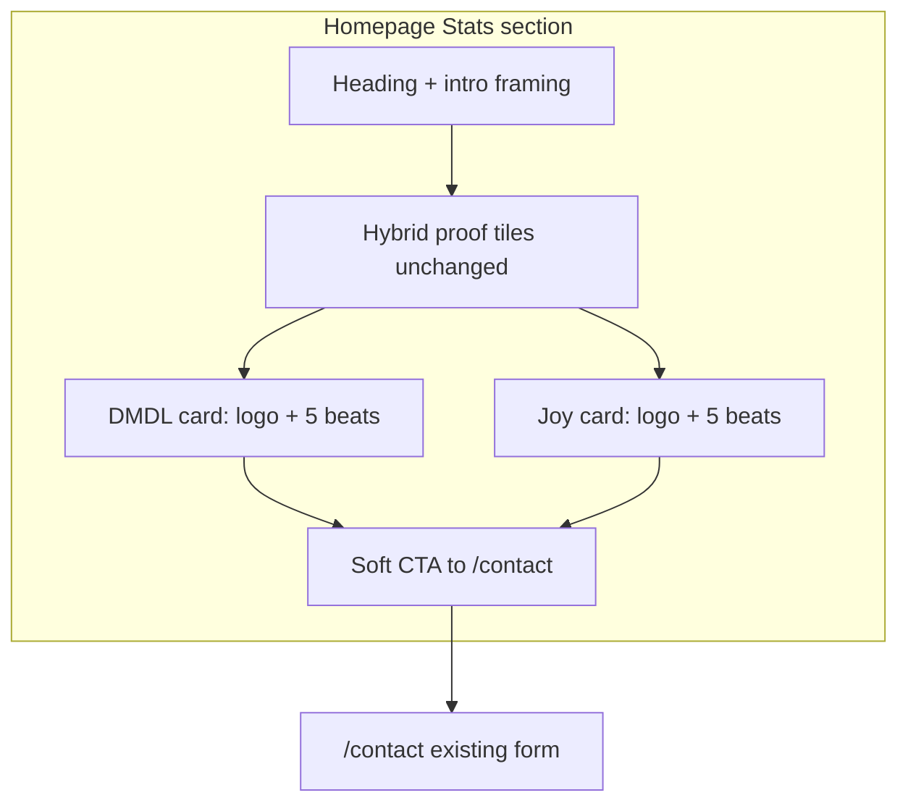

# Teaching Proof in Homepage Stats - Plan

## Goal Capsule

- **Objective:** Rewrite the two homepage client proof stories so visitors re-learn Arturo as decide-before-build work (discovery/reframing first), not custom-build-for-hire—using a shared teaching template on DMDL and Joy for Books, accurate maturity labels, and a soft CTA that invites a recent workflow example.
- **Product authority:** `STRATEGY.md`; `docs/plans/2026-07-21-001-update-website-copy-plan.md` (named clients, hybrid proof, no inflated outcomes). Product Contract below is authoritative for behavior. This plan owns **teaching proof in homepage Stats only**.
- **Open blockers:** Owner story arcs for beats (1)–(3) on each client are **implementation content inputs**, not product-shape forks. Structure, status (R6), CTA, and tests can proceed; do not publish invented discovery/path claims. Owner will supply arcs after this plan (session decision).
- **Execution profile:** Content + light UI structure in one homepage section; small PR; test-first for structure/status/CTA assertions where practical.
- **Product Contract preservation:** restructured, no scope change — Outstanding Questions Q1–Q3 resolved into KTDs / Open Questions; no R-ID renumber or meaning change.

---

## Product Contract

### Summary

Deepen the existing homepage Stats client stories (DMDL and Joy for Books only) with a shared scannable teaching template that puts discovery and reframing first, states honest beta/in-development maturity, and ends the section with one soft CTA toward contact framed as “bring a recent example.”

### Problem Frame

Public copy already positions Workflow Assessment and decide-before-build correctly, but thin client proof still reads like a small portfolio of systems.
Prospects who reach the site often still open with a feature list or build request instead of a stuck workflow.
The proof surface is the highest-leverage place to re-teach the engagement model without a new service line or brochure site.
Existing DMDL and Joy blurbs understate maturity nuance (especially DMDL multi-role beta) and do not surface the discovery arc that distinguishes this offer from build-for-hire.

### Key Decisions

- **Own teaching proof via homepage Stats only** (session-settled: user-directed — chosen over new case routes, flagship-only depth, or a separate Proof section: smallest surface that still re-teaches the model). Governs R1, R8.
- **Shared teaching template on both stories (Approach A)** (session-settled: user-approved — chosen over prose-first or flagship+sibling: equal pedagogical structure so the model is hard to miss). Governs R2–R4.
- **Discovery/reframing is the hero; build detail is secondary** (session-settled: user-approved — chosen over before/after-tool focus or build-centric portfolio tone: avoids reinforcing custom-build-for-hire). Governs R2, R5.
- **Named clients only: DMDL + Joy for Books** (session-settled: user-directed — chosen over anonymized third story or internal-only proof: stay inside already-approved public names). Governs R1, R6.
- **Success signal: visitor shows up with a workflow example, not a feature list** (session-settled: user-approved — chosen over assessment-before-build language alone or self-select-out metrics as primary: behavioral reframe of the first message). Governs R7, R9, SC1.
- **Soft CTA under the two stories** (session-settled: user-approved — chosen over stories-only: closes the loop from proof to the right first message). Governs R7.
- **Status precision: DMDL beta with described tester groups; Joy active development** (session-settled: user-directed — supersedes vague “implementation learning” for DMDL without claiming finished production outcomes). Governs R6.
- **Owner story arcs after plan** (session-settled: user-directed — chosen over blocking plan-write on arcs: owner authors beats (1)–(3) later; structure/status/CTA planned and implementable first). Governs R10.

### How This Work Fits Together

<!-- ce-section: work-relationships -->

This plan owns **teaching proof in homepage Stats**. Broader offer/UX areas mapped in the brainstorm remain candidates, not requirements here:

- Contact path + fit filter — Can proceed independently of this plan; Shares success language around “recent workflow example.”
- Assessment depth (Process / brief clarity) — Can proceed independently of; Shares decide-before-build pedagogy.
- CAB packaging polish — Can proceed independently of.
- Cheap-win bundle (fit block, success page, CTA hygiene) — Can proceed independently of; may later **Share** CTA wording with R7.
- CAB public price, blog-as-proof, new case routes — Outside this plan (see Scope Boundaries).

### Actors

- A1. **Prospective buyer** — decision-maker or recommender in a small org who currently may misread Arturo as custom-build-for-hire.
- A2. **Site operator (Arthur)** — owns factual accuracy of client stories and status labels before publish.

### Requirements

**Surface and assets**

- R1. Teaching proof remains on the homepage Stats section only: exactly the two approved named clients, DMDL and Joy for Books; no new case-study routes and no additional named clients in this work.
- R8. Hybrid proof tiles (public products, internal workflows, client contexts, AI work) may remain above or with the client stories unless they actively undermine the teaching goal; default is leave them unchanged.

**Story template (both clients)**

- R2. Each client story presents the same scannable teaching beats in visitor-facing order: (1) what looked true / tempting frame, (2) what discovery found (real constraint / how work actually moves), (3) path that followed (only what is true for that engagement), (4) honest status, (5) optional one-line implication that reinforces starting from a recent case—not a predetermined build.
- R3. Discovery and reframing occupy primary narrative weight; implementation or product detail is secondary supporting context, never the lead claim.
- R4. Template presentation is scannable (clear beat structure on both cards); it must not invent process steps, outcomes, ROI, or completion claims.

**Honesty and status**

- R5. Copy continues the hybrid proof rule: describe work at the level the evidence supports; no guaranteed savings, fixed ROI, or percentage improvements; unfinished or in-progress work is never framed as a finished portfolio case study.
- R6. Status language is accurate and distinct per client:
  - **DMDL:** beta phase—admin/staff users testing the website portal and native iOS/Android app; external workforce users testing the native phone app. Do not use weaker labels (e.g. generic “implementation learning”) that understate multi-role beta, and do not claim general public production launch unless separately approved.
  - **Joy for Books:** active development / in development (or equivalent honest label). Inventory-centered system framing may remain only if still accurate and secondary to discovery/reframing.

**CTA and conversion pedagogy**

- R7. Below the two stories, include one soft primary CTA to `/contact` whose wording models the desired first message (recent example of where the work breaks / a bottleneck with a concrete case)—not a feature list or “build me X.”
- R9. Section framing (heading and short intro, if adjusted) must support “real operating context” and decision-path work, not a pure “apps we shipped” portfolio read.

**Content ownership**

- R10. Publishable story facts for beats (1)–(3) are owner-approved; the implementation may ship structure and status/CTA without inventing case facts; beats (1)–(3) land only after A2 supplies story arcs.

### Key Flows

- F1. Homepage teaching pass
  - **Trigger:** A1 lands on the homepage and scrolls to Stats / client contexts.
  - **Actors:** A1
  - **Steps:** Reads hybrid context if present; reads both templated stories with discovery first; notes honest status; hits soft CTA; continues to contact with a workflow-example mindset.
  - **Outcome:** A1 can restate that work starts from reconstructing the workflow and deciding a path, not from a predetermined build.
  - **Covered by:** R1–R7, R9

- F2. Contact handoff from proof
  - **Trigger:** A1 activates the Stats soft CTA.
  - **Actors:** A1
  - **Steps:** Navigates to `/contact`; sees existing warm prompts that ask where the workflow breaks down.
  - **Outcome:** First message is more likely a concrete stuck workflow than a feature list (SC1).
  - **Covered by:** R7, R9

### Acceptance Examples

- AE1. Builder-for-hire misread reduced by structure
  - **Covers:** R2, R3, R9
  - **Given:** A1 currently assumes Arturo primarily builds custom systems on request
  - **When:** A1 reads both Stats client stories
  - **Then:** Both stories lead with discovery/reframing before any implementation detail, and neither leads with stack or feature delivery as the main point

- AE2. DMDL status honesty
  - **Covers:** R6, R5
  - **Given:** DMDL is in beta with admin/staff on web + iOS/Android and external workforce on the native phone app
  - **When:** A1 reads the DMDL status beat
  - **Then:** Status conveys multi-role beta testing of those surfaces and does not claim finished general production launch or guaranteed business outcomes

- AE3. Joy status honesty
  - **Covers:** R6, R5
  - **Given:** Joy for Books is still in active development
  - **When:** A1 reads the Joy story
  - **Then:** Status remains in-development (or equivalent); no language implies a completed handoff outcome that has not occurred

- AE4. Soft CTA models the right ask
  - **Covers:** R7, SC1
  - **Given:** A1 finishes the two stories
  - **When:** A1 sees the Stats CTA
  - **Then:** CTA links to `/contact` and wording invites a recent workflow example / bottleneck case, not a predetermined feature list

- AE5. No new case surface
  - **Covers:** R1
  - **Given:** This work is shipped
  - **When:** A1 looks for case-study URLs or additional named clients in Stats
  - **Then:** Only DMDL and Joy appear as named client stories; no new case-detail routes are introduced by this work

### Success Criteria

- SC1. **Primary behavioral signal:** After exposure to the updated proof, prospects more often open with a concrete workflow example (or equivalent stuck-process description) rather than a feature list or pure build request—observable in fit calls and contact messages (qualitative; no fabricated conversion %).
- SC2. **Pedagogical scan test:** A cold reader can name “discover/reframe the workflow, then decide the path” as the lesson of the client stories without reading Services.
- SC3. **Honesty test:** A reviewer familiar with both engagements finds no overstated maturity or outcome claims relative to R6 and R5.

### Scope Boundaries

**In scope**

- Homepage Stats client-story content structure and copy (and minimal section framing needed for R9)
- Soft CTA under the two stories
- Accurate status language for DMDL beta and Joy in development

**Deferred for later** (from broader offer/UX map; not this plan)

- Contact form field changes, fit/disqualify homepage block, success-page expectations rewrite
- Workflow Assessment detail page or Process deep-dive
- Custom AI Build rename/packaging overhaul or public CAB price
- Blog posts as proof vehicle
- Anonymized third case or internal-only proof story
- Full case-study pages or `/customers` content (today redirects to `#team`)

**Outside this product’s identity**

- Guaranteed ROI / savings percentages
- Presenting unfinished work as finished portfolio outcomes
- Software-factory / multi-case agency portfolio positioning
- New service lines beyond Workflow Assessment and Custom AI Build

### Dependencies / Assumptions

- D1. DMDL and Joy for Books remain the only approved public named client contexts unless strategy/copy governance changes.
- D2. Owner (A2) supplies story arcs for beats (1)–(3) after this plan; final publish of those beats requires that input (R10).
- A1. Existing contact page already prompts for where the workflow breaks down; Stats CTA does not require contact form schema changes.
- A2. Framer Motion / reduced-motion patterns on Stats may remain; this work is content and light structure, not a motion redesign.

### Outstanding Questions

**Resolve Before Planning**

- None.

**Deferred to implementation (non-blocking)**

- Q1. Exact micro-label strings for beats (e.g. “What looked true” vs “Assumed”) — implementer chooses plain language consistent with site tone; structure is fixed by KTD1.
- Q2. Owner story arcs for DMDL and Joy beats (1)–(3) — supplied by A2 after plan; required before merge of discovery/path copy (R10).

### Sources / Research

- `STRATEGY.md` — target problem, approach, marketing one-liner
- `docs/plans/2026-07-21-001-update-website-copy-plan.md` — named clients, qualitative ROI only, hybrid proof
- `components/Stats.tsx` — current proof tiles, DMDL/Joy blurbs and status lines
- `components/Services.tsx` — `dl`/`dt`/`dd` scannable details + contact links (pattern to mirror)
- `components/Hero.tsx`, `app/contact/page.tsx` — bottleneck / stuck-workflow CTA language
- `e2e/homepage.spec.ts` — logo and client-context assertions to extend

---

## Planning Contract

### Key Technical Decisions

- KTD1. **Labeled beats via Services-style `dl`/`dt`/`dd` (or equivalent)** — each client card renders the five teaching beats as scannable labeled rows, not a single prose paragraph. (session-settled: user-approved — chosen over prose-first cards: pedagogy and scan test). Aligns R2, R4.
- KTD2. **Keep hybrid proof tiles unchanged** unless a post-copy review shows they fight the teaching frame; default ship with current four tiles. Aligns R8.
- KTD3. **Soft CTA as section-level `Link` under both cards** — one control, `href="/contact"`, primary/soft button or underlined link matching homepage CTA weight (Hero uses `btn-primary`; Services uses underlined link—prefer a single clear CTA, e.g. `btn-primary` or solid white-on-black equivalent for the black Stats band). Aligns R7.
- KTD4. **Data shape: structured story objects in `Stats.tsx`** — replace flat `detail` string with beat fields (`assumed` / `discovery` / `path` / `status` / optional `implication`) so both cards share one render path. No new routes or content files required.
- KTD5. **Content gate** — status (R6), framing (R9), CTA (R7), and template chrome ship without inventing arcs; beats (1)–(3) filled only from owner-supplied story arcs. Local/WIP branches may use temporary stubs; production merge of discovery/path text requires A2 arcs. Aligns R10.
- KTD6. **Tests** — unit test for template structure/status/CTA presence; extend Playwright homepage e2e for beta/status signals, labeled-beat visibility (stable selectors or text), CTA href/wording, and continued ban on unapproved clients.

### High-Level Technical Design

### Assumptions

- Owner story arcs will arrive in chat, a doc paste, or PR review comments; implementer maps them into the five-beat fields without changing the product model.
- No CMS or Supabase content for client stories in this pass—static component data remains correct.
- `next/link` and existing Tailwind / `btn-primary` utilities are sufficient; no design-system expansion.

### Sequencing

1. U1 — structure, status, framing, CTA (no invented arcs).
2. U2 — plug owner arcs into beats (1)–(3) and optional implication; honesty pass.
3. U3 — unit + e2e coverage (can start in parallel with U1 for structure assertions; complete after U2 for full copy).

---

## Implementation Units

### U1. Stats teaching structure, status, framing, and CTA

- **Goal:** Restructure `Stats` client stories into the shared labeled-beat template with accurate status lines and a soft contact CTA; leave hybrid tiles; do not invent discovery/path arcs.
- **Requirements:** R1, R2, R4, R5, R6, R7, R8, R9, R10 (structure + status only)
- **Dependencies:** None
- **Files:**
  - Modify: `components/Stats.tsx`
  - Optional pattern reference: `components/Services.tsx`, `components/Hero.tsx`
- **Approach:**
  1. Replace `proofLogos[].detail` with a beat-structured object (labels + text fields for assumed, discovery, path, status, optional implication).
  2. Render each beat with scannable labels (KTD1); discovery-related beats visually primary (order and weight per R3).
  3. Set **status** copy per R6 now (DMDL multi-role beta; Joy in development). Leave assumed/discovery/path empty, omitted, or clearly non-public stubs only if needed for layout—**do not** invent case facts for production.
  4. Add one soft CTA under the two-card grid to `/contact` with workflow-example wording (KTD3); align tone with Hero (“bottleneck” / recent example) and contact page (“where the work gets stuck”).
  5. Adjust intro paragraph only as needed for R9 (decision-path / operating context, not portfolio of apps shipped).
  6. Keep logos, names, black section chrome, motion + reduced-motion hooks.
- **Patterns to follow:** Services `dl` detail rows; Hero/Services contact links; existing Stats motion wrappers.
- **Test scenarios:**
  - Happy path: section still shows DMDL and Joy logos/names only.
  - Happy path: DMDL status text includes beta and distinguishes admin/staff vs external workforce testing surfaces (or stable substrings agreed in copy).
  - Happy path: Joy status indicates in development / active development.
  - Happy path: CTA present, `href="/contact"`, wording mentions recent example or bottleneck / stuck workflow—not “build me.”
  - Edge: reduced-motion path still renders static content (no reliance on animation for readability).
  - Covers AE2, AE3, AE4, AE5 (structure/status/CTA; discovery lead fully proven after U2).
- **Verification:** Visual homepage check; typecheck/lint clean for `Stats.tsx`.

### U2. Owner story arcs into discovery-first beats

- **Goal:** Fill beats (1)–(3) and optional (5) from owner-authored story arcs without overstating maturity or outcomes.
- **Requirements:** R2, R3, R4, R5, R10; SC2, SC3
- **Dependencies:** U1; owner story arcs for DMDL and Joy
- **Files:**
  - Modify: `components/Stats.tsx` (beat text only unless small label tweaks)
- **Approach:**
  1. Map each arc into assumed → discovery → path → (keep status from U1) → optional implication.
  2. Enforce discovery/reframing as lead substance; demote stack/feature detail.
  3. Honesty pass against R5/R6 and AE1–AE3; no ROI percentages or false completion claims.
  4. If an arc is thin for a beat, omit or shorten that beat rather than invent.
- **Execution note:** Do not start U2 body copy until arcs are provided; structure from U1 can already be on a branch.
- **Test scenarios:**
  - Covers AE1: both cards expose discovery-oriented content before implementation-heavy detail.
  - Covers AE2/AE3: status lines unchanged in meaning after arc plug-in.
  - Regression: still only two named clients; no HG Jones / Texas Head Start.
- **Verification:** Owner skim (SC3); cold-read pedagogy check (SC2).

### U3. Unit and e2e coverage for teaching proof

- **Goal:** Lock structure, status honesty signals, CTA, and named-client constraints in automated tests.
- **Requirements:** R1, R2, R6, R7; AE2–AE5
- **Dependencies:** U1 (minimum); U2 for full discovery-text assertions
- **Files:**
  - Create: `__tests__/stats-teaching-proof.test.tsx` (or equivalent Vitest + Testing Library name)
  - Modify: `e2e/homepage.spec.ts`
- **Approach:**
  1. Unit-test render of Stats: two clients, labeled beats present when content is filled, status substrings, CTA role/link.
  2. Extend homepage e2e: keep logo alts; assert status/beta signals; assert CTA to contact; assert absence of unapproved clients; after U2, assert at least one discovery-oriented phrase per card if stable.
  3. Prefer resilient matchers (roles, partial text) over brittle full paragraphs.
- **Patterns to follow:** `__tests__/contact-form.test.tsx`, `e2e/homepage.spec.ts` existing copy assertions.
- **Test scenarios:**
  - Unit: renders DMDL and Joy; not other clients.
  - Unit: CTA links to `/contact`.
  - Unit: DMDL status includes beta-related language; Joy includes development language.
  - Unit: when beats provided, labels/order match template (assumed before path).
  - E2E: homepage still workflow-first elsewhere; proof section matches above.
  - Covers AE4, AE5; AE2/AE3.
- **Verification:** `npm run test` and `npm run test:e2e` (or CI-equivalent) pass.

---

## Verification Contract

| Gate | Command / check | Applies |
|------|-----------------|---------|
| Lint | `npm run lint` | Always |
| Types | `npm run typecheck` | Always |
| Unit | `npm run test` | U3; after U1/U2 as needed |
| E2E | `npm run test:e2e` | U3; homepage smoke |
| Build | `npm run build` | Before PR merge |
| Honesty / pedagogy | Manual SC2–SC3 (owner or cold reader) | After U2 |

---

## Definition of Done

**Global**

- [ ] Both client stories use the shared labeled teaching template on homepage Stats only.
- [ ] DMDL and Joy status match R6; no inflated outcomes (R5).
- [ ] Soft CTA under stories points to `/contact` with workflow-example framing (R7).
- [ ] Beats (1)–(3) reflect owner story arcs (R10)—not agent-invented case facts.
- [ ] Hybrid tiles unchanged unless an explicit post-arc tweak was justified (R8/KTD2).
- [ ] Unit + e2e coverage green; lint, typecheck, build green.
- [ ] No abandoned stubs or placeholder “TODO discovery” text in production-bound copy.
- [ ] Abandoned experimental copy/branches cleaned from the final diff.

**Per unit**

- U1: structure, status, CTA, framing shippable without false case claims.
- U2: owner arcs integrated; AE1 and honesty checks satisfied.
- U3: automated tests enforce non-regression on logos, status signals, CTA, client allowlist.

---

## Risks and Dependencies

| Risk | Mitigation |
|------|------------|
| Invented discovery arcs if implementer fills gaps | Content gate KTD5; U2 blocked on owner input |
| Template feels brochure-y on black band | Match Services label density; short beat sentences |
| E2E brittle on full paragraphs | Assert labels, status keywords, CTA href |
| Status under/over-claims DMDL beta | Use multi-role testing language from R6 only |

**Upstream dependency:** Owner story arcs for DMDL and Joy (after plan is acceptable).

---

## Suggested owner arc format (for later paste)

For each client, bullets are enough:

1. **What looked true** — tempting tool/feature/process frame  
2. **What discovery found** — real constraint / how work actually moves  
3. **Path that followed** — only what is true (reframe, feasibility, build boundary, etc.)  
4. **Status** — already fixed in plan for labels; note only if something changed  
5. **Implication** (optional) — one line for visitors (“start from a recent case…”)
